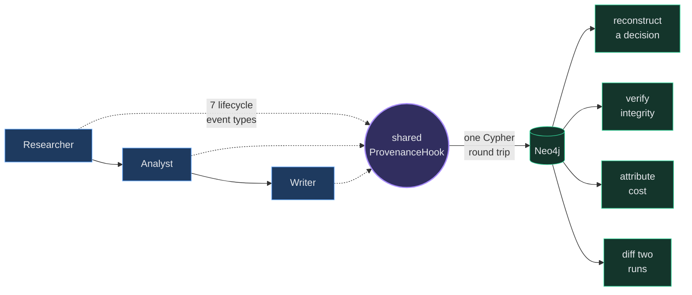
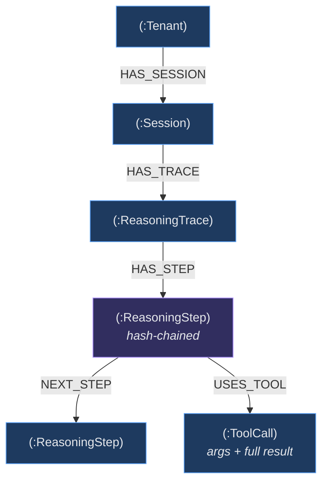

# TraceForge

[](https://github.com/ElijahUmana/traceforge/actions/workflows/ci.yml)
[](LICENSE)
[](pyproject.toml)
[](https://neo4j.com)

**Decision provenance for multi-agent systems.** TraceForge turns transient agent lifecycle events into a durable, queryable, tamper-evident graph — so when a swarm of agents makes a decision, you can reconstruct exactly which agent decided what, from which tool output, and what that output cost.

---

## The problem

Agents hand each other conclusions, not reasoning. Agent A calls a tool, gets a number, and passes a summary downstream. Agent B builds on the summary. Agent C writes it up. If the original number was wrong, nothing downstream knows — and afterwards there is no artifact that connects the final decision back to the tool call that poisoned it.

Logs don't solve this. You can grep a log line; you cannot ask it *"which entity did step 4 touch, what else touched that entity, and which decisions were built on it?"* That question is a graph traversal, so the substrate has to be a graph.

---

## How it works

One `ProvenanceHook` instance is shared across **every** agent in the swarm. That single detail is the design:

```python
hook = ProvenanceHook(trace_id=trace_id, session_id=session_id, tenant_id=tenant_id)

researcher = Agent(name="Researcher", hooks=[hook], ...)
analyst    = Agent(name="Analyst",    hooks=[hook], ...)
writer     = Agent(name="Writer",     hooks=[hook], ...)
```

Give each agent its own hook and you get three disconnected chains with three independent step counters — per-agent traces, and no cross-agent provenance at all. Sharing one instance is what makes `step_number` monotonic and the hash chain continuous *across agent boundaries*, which is the only reason a single query can walk a decision back through every agent that contributed to it.



The hook intercepts seven Strands lifecycle events — agent start/end, tool call start/end, model call start/end, initialization — computes a SHA-256 over a canonical preimage, and writes a typed node plus its edges to Neo4j in a **single Cypher round trip** that also maintains the trace-level rollups and back-links the previous step.

---

## The graph



Backed by **17 constraints** (uniqueness + existence) and **17 indexes** (vector, full-text, range, composite). Existence constraints on `step_hash` and `prev_hash` push the integrity invariant down into the database, where it belongs. The composite index on `(trace_id, step_number)` is what makes chain walks cheap.

---

## Integrity

Each step's hash covers a **canonical preimage** — an explicit field list, defined once in [`backend/app/hashchain.py`](backend/app/hashchain.py), consisting only of fields persisted verbatim on the node:

```
step_hash = SHA-256( prev_hash ‖ trace_id ‖ step_id ‖ step_number ‖ agent_name ‖
                     event_type ‖ created_at ‖ thought ‖ action ‖ observation ‖
                     model_id ‖ token_input ‖ token_output ‖ cost_usd ‖
                     latency_ms ‖ status )
```

The preimage matters more than the algorithm. If a hash covers fields that aren't all stored, it can never be recomputed later — you can only compare stored hashes to each other, which catches a **deleted or reordered** step but silently passes an **edited** one. Because every hashed field here is persisted, verification re-derives each hash from the row's own content and reports the two failure modes separately:

| Failure | Meaning | Caught by |
|---|---|---|
| `broken_links` | step N's `prev_hash` ≠ step N−1's `step_hash` | linkage comparison |
| `content_mismatches` | stored `step_hash` ≠ hash recomputed from that step's fields | recomputation |

Only the second requires recomputation, and it is the one comparison alone cannot see. Both are exercised by unit tests that mutate a stored field and assert detection while every link still matches.

```bash
GET /api/why/{trace_id}
→ { "hash_chain_valid": false,
    "hash_chain": { "content_mismatches": [{ "step_number": 3, ... }], ... } }
```

---

## What you can ask it

**Reconstruct a decision.** Walk every step across all agents, in order, with the tool output each one saw:

```cypher
MATCH (trace:ReasoningTrace {trace_id: $id})-[:HAS_STEP]->(step)
OPTIONAL MATCH (step)-[:USES_TOOL]->(tc)
RETURN step.agent_name, step.event_type, step.action,
       tc.tool_name, tc.result_summary, step.step_hash
ORDER BY step.step_number
```

**Find the poison.** When a decision is wrong, locate the tool call that introduced the bad data:

```cypher
MATCH (trace:ReasoningTrace {trace_id: $id})-[:HAS_STEP]->(step)-[:USES_TOOL]->(tc)
WHERE tc.tool_name = $tool AND tc.result CONTAINS $bad_value
RETURN step.agent_name AS culprit_agent,
       step.step_number AS when_in_chain,
       tc.result_summary AS what_it_returned,
       step.step_hash    AS proof
```

Everything downstream of `when_in_chain` was built on that value.

**Diff two runs.** Align two traces on step number and find the first point they diverged — the fastest way to explain why the same input produced different answers:

```cypher
MATCH (t1:ReasoningTrace {trace_id: $a})-[:HAS_STEP]->(s1)
MATCH (t2:ReasoningTrace {trace_id: $b})-[:HAS_STEP]->(s2)
WHERE s1.step_number = s2.step_number
RETURN s1.step_number, s1.agent_name,
       s1.observation <> s2.observation AS diverged
ORDER BY s1.step_number
```

**Attribute cost.** Every step carries `cost_usd`, `latency_ms`, `model_id`, and token counts, so spend rolls up by tenant, agent, tool, or period.

The full query library lives in [`cypher/`](cypher/) — parameterized, commented, and usable without the rest of this repo.

---

## Worked example: tracing a bad approval

The repo seeds three credit applications. One has its revenue inflated tenfold in the underlying filing data — $15M reported as $150M.

| Company | Amount | Condition | Outcome |
|---|---|---|---|
| Meridian Manufacturing | $10M | Clean financials, credit score 82 | Approved — clean chain |
| Zenith Biotech | $25M | Revenue inflated 10× in source data | Wrongly approved |
| Atlas Logistics | $50M | Sound financials, exceeds the $30M automated ceiling | Escalated |

Zenith is the interesting one. The agents behave correctly given what they were told; the failure is upstream, in a tool result. Afterwards, one query recovers it: `fetch_sec_filings` at step 2 returned $150M, and the Analyst's risk score and the Writer's memo were both built on that value. The reasoning is auditable even though the conclusion was wrong — which is the entire point.

---

## API

| Endpoint | Purpose |
|---|---|
| `POST /api/evaluate` | Run the swarm on an application; returns a `trace_id` immediately |
| `GET /api/why/{trace_id}` | Full provenance chain plus a recomputed integrity report |
| `POST /api/audit/{trace_id}` | Structured audit report — regulation citation, per-step data-source attribution, genesis/final hash bookends |
| `GET /api/cost` | Cost rollup by tenant, agent, and tool |
| `GET /api/traces` | Recent decision traces |
| `GET /api/stream/{trace_id}` | SSE stream of steps as they land |

---

## Running it

Requires Python 3.11+, Node 20+, a Neo4j instance (Aura or local), and an Anthropic API key.

```bash
git clone https://github.com/ElijahUmana/traceforge.git
cd traceforge

cp .env.example .env
# NEO4J_URI, NEO4J_USERNAME, NEO4J_PASSWORD, ANTHROPIC_API_KEY

make install
make schema     # 17 constraints + 17 indexes
make seed       # three applications, one with poisoned source data
make start      # API on :8000, dashboard on :3000
```

Every trace the API returns comes from a real swarm run. Traces generated for offline UI work are opt-in behind `TRACEFORGE_ALLOW_SYNTHETIC_TRACES=1` and carry a `:SyntheticTrace` label in the graph, so provenance holds at the storage layer rather than by convention.

### Checks

```bash
ruff check backend/            # lint
pytest -m "not integration"    # unit tests — no Neo4j, no keys, no network
pytest -m integration          # end-to-end; needs a live Neo4j and a running server
```

---

## Layout

```
backend/app/
├── hooks.py               ProvenanceHook — 7 lifecycle events → hash-chained steps
├── hashchain.py           canonical preimage + recomputing verifier
├── provenance_writer.py   single-round-trip Cypher writes, rollups, back-linking
├── swarm.py               Strands GraphBuilder DAG, one shared hook
├── tools.py               10 Neo4j-backed agent tools
├── queries.py             why / cost / verify / poison-trace
└── routes.py              FastAPI endpoints
cypher/                    standalone parameterized query library
frontend/                  Next.js dashboard — traces, provenance, cost, audit, graph
backend/tests/             unit tests (offline) + integration suite
```

---

## Stack

Built on [AWS Strands Agents](https://strandsagents.com) for the swarm and its lifecycle hooks, [Neo4j](https://neo4j.com) for the provenance graph, Claude via the [Anthropic API](https://docs.anthropic.com) for agent reasoning, FastAPI for the API, and Next.js for the dashboard. A deployment script for [Amazon Bedrock AgentCore](https://aws.amazon.com/bedrock/agentcore/) is included under `deploy/` as a reference path; the supported route today is running it yourself.

## Background

- [Why Multi-Agent LLM Systems Fail](https://www.augmentcode.com/guides/why-multi-agent-llm-systems-fail-and-how-to-fix-them) — failure taxonomy across annotated execution traces; the recurring root cause is agents sharing outputs without sharing reasoning.
- [VeriTrail: Detecting Hallucination and Tracing Provenance](https://www.microsoft.com/en-us/research/blog/veritrail-detecting-hallucination-and-tracing-provenance-in-multi-step-ai-workflows/) — Microsoft Research, on provenance tracing in multi-step workflows.
- [OWASP Top 10 for Agentic AI](https://www.startupdefense.io/blog/owasp-top-10-agentic-ai-security-risks-2026) — hallucination propagation between agents as a top-ranked risk.
- [Strands SDK #2216](https://github.com/strands-agents/sdk-python/issues/2216) — the open "Agent Harness" request for a built-in audit surface; this repo is one answer to it.
- EU AI Act Article 12 requires record-keeping that makes high-risk AI decisions reconstructable after the fact. Credit scoring is high-risk under Annex III.

## Contributors

[Elijah Umana](https://github.com/ElijahUmana) · [Jay Yu](https://github.com/Pepps233) · [Ngan Huong](https://github.com/nganhuongg)

## License

MIT — see [LICENSE](LICENSE).
